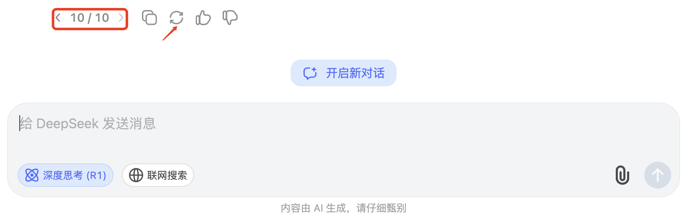

# **Happy Deepseek**

当deepseek返回服务器繁忙时，自动点击重试！

## **原理**

当检测到deepseek返回“服务器繁忙，请稍后再试。”时，自动点击`🔁`重新生成按钮

## **安装**

### **开发者模式**
1. 下载此项目
2. 打开chrome，并在地址栏中访问 `chrome://extensions/`
3. 点击右上角，启用 **开发者模式**
4. 点击左上角`加载已解压的扩展程序`，然后选择此项目文件夹

### **Chrome应用商店**
> 上线中

